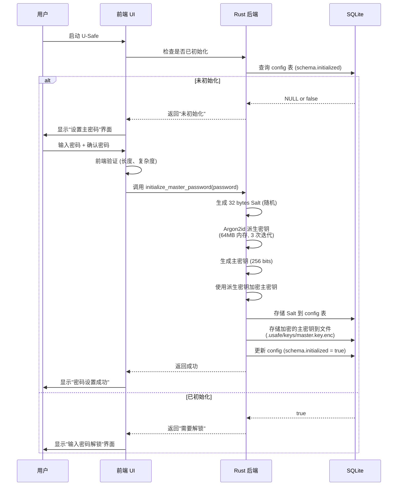
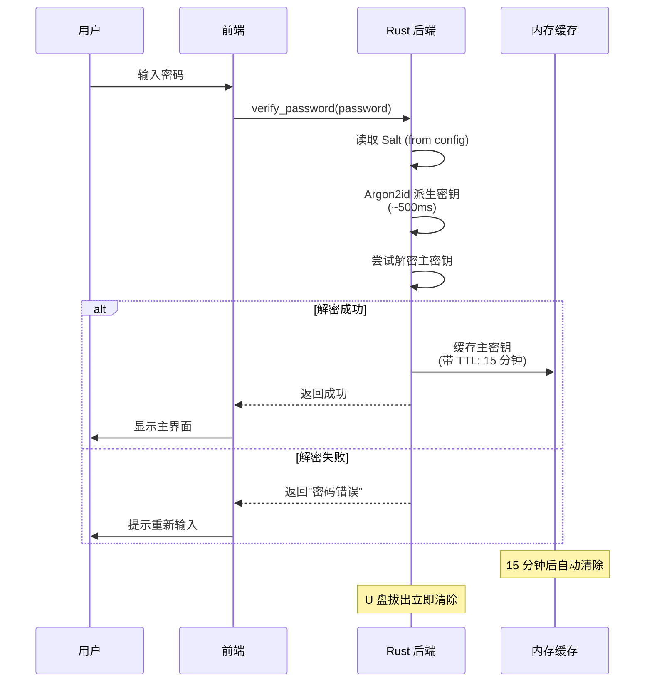
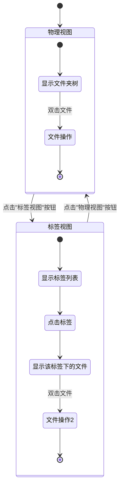
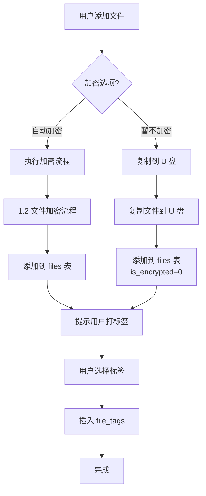

# 产品需求文档 (PRD) - U-Safe (万能保险箱)

**版本：** v1.0

**状态：** 初稿

**日期：** 2026-03-08

**目标平台：** Windows 10/11, macOS (Intel/Apple Silicon)

---

## 1. 产品概述

U-Safe 是一款专为 U 盘用户设计的轻量化管理工具。它集成了**军事级文件加密**与**非侵入式标签整理**功能,旨在不改变用户原有文件路径习惯的前提下,提供跨平台的隐私保护与高效检索体验。

## 2. 用户痛点与解决方案

* **痛点 1：** 办公电脑无管理员权限,无法安装传统加密驱动。
* **方案：** 基于 Tauri 的用户态 WebDAV 或应用层虚拟视图,完全免提权运行。


* **痛点 2：** U 盘文件乱,不敢随便移动位置(怕链接失效)。
* **方案：** 建立虚拟标签索引,物理路径不动,逻辑视图随心整理。


* **痛点 3：** 跨平台兼容性差,Win 加密 Mac 打不开。
* **方案：** 同套 Rust 加密逻辑 + exFAT 兼容层,数据全系统通用。


---

## 3. 功能需求

### 3.1 核心功能模块

| 模块 | 子功能 | 详细说明 |
| --- | --- | --- |
| **环境自适应** | 系统识别 | 自动判断 Win/Mac,切换 UI 主题、字体及窗口控制钮位置。 |
| **加密引擎** | 颗粒化加密 | 支持整个"保险箱"文件夹加密、特定文件夹加密及单文件加密。 |
|  | 流式加解密 | 针对大文件采用 Chunk 模式,确保低内存占用,防止崩溃。 |
| **标签管理** | 虚拟视图 | 用户可为文件打标签,在"标签视图"中聚合显示,不改变物理存储路径。 |
|  | 快速检索 | 基于 SQLite 全文索引,支持毫秒级文件名及标签模糊搜索。 |
| **安全闭锁** | 异常防护 | 拔掉 U 盘或程序关闭时,立即销毁内存密钥,自动卸载虚拟挂载点。 |

### 3.2 存储布局设计 (U 盘端)

* **`/U-Safe.exe`**：Windows 启动入口。
* **`/U-Safe.app`**：macOS 启动入口包。
* **`/.usafe/`**(系统隐藏)：
  * `config.json`：用户偏好设置。
  * `index.db`：SQLite 标签与文件元数据索引。
  * `data/`：存放加密后的二进制分块数据。


---

## 4. 非功能需求

### 4.1 性能要求

* **启动速度：** 从双击到进入主界面,冷启动时间在 SSD U 盘上应 $< 2$ 秒。
* **体积控制：** 单端二进制文件压缩后应控制在 $10MB$ 以内。
* **加密速度：** > 50 MB/s (在支持 AES-NI 的硬件上)。
* **解密速度：** > 50 MB/s (在支持 AES-NI 的硬件上)。
* **大文件处理：** 100MB 文件加密 < 2 秒。

### 4.2 安全性要求

* **算法：** 强制使用 AES-256-GCM 认证加密。
* **零残留：** 严禁在宿主电脑本地硬盘记录任何解密后的明文缓存或日志。

---

## 5. UI/UX 交互规范

* **原生感：**
  * Windows 端使用 Mica 材质和 Segoe UI 字体。
  * Mac 端使用 SF Pro 字体及标准"交通灯"按钮布局。


* **操作模式切换：**
  * **物理视图：** 传统文件夹树状结构,操作即物理改变。
  * **影子视图：** 按标签分类展示,点击"删除"仅移除标签,除非用户确认粉碎文件。


---

## 6. 技术架构选型

* **框架：** Tauri (Rust 后端 + Web 前端)。
* **前端：** React + TailwindCSS (仿原生 Explorer/Finder 组件库)。
* **数据库：** SQLite (rusqlite 同步驱动，单用户模式)。
* **通信：** Tauri Command (JSON-RPC) 实现前端与 Rust 底层的高效数据交换。

---

## 7. 风险评估

1. **SmartScreen 拦截：** 需要准备 EV 代码签名证书,或在 U 盘根目录放置说明引导页。
2. **杀毒软件误报：** 需向各大杀软厂商提交误报白名单申请,尤其是针对 Rust 编译的加密逻辑。
3. **权限限制：** 在极少数严苛环境中,WebView2 可能未预装。
   * **应对：** 软件启动前进行环境自检,必要时提示用户下载微软官方 WebView2 运行时。


---

## 8. 路线图 (Roadmap)

* **Q1：** 完成双端编译链路,实现基础 AES 文件加密。
* **Q2：** 实现 SQLite 标签索引引擎,完成 UI 1:1 复刻。
* **Q3：** 内测、申请数字签名、优化大文件传输稳定性。

---

**我可以为您做些什么？** 如果您确认此 PRD 无误,我可以为您编写第一份 **Tauri 配置文件 (tauri.conf.json)** 或者提供 **Rust 后端识别 U 盘根目录路径** 的核心代码。

---

# 核心逻辑规格 (从 PRD_Core_Logic.md 合并)

# 产品核心逻辑详细设计 - U-Safe

**版本**: v1.0
**状态**: 设计文档
**日期**: 2026-03-09
**依赖**: ADR 0003 (加密方案), Database Schema

---

## 概述

本文档详细阐述 U-Safe 的核心业务逻辑，包括加密/解密流程、标签管理、虚拟视图切换和文件操作。所有设计基于已确定的技术方案：
- **加密**: AES-256-GCM + 64KB 分块 + Argon2id KDF (ADR 0003)
- **存储**: SQLite + 5 个核心表 (Database Schema)
- **架构**: Tauri + Rust + React (ADR 0002)

---

## 1. 加密/解密流程

### 1.1 用户首次设置密码流程

**场景**: 用户首次启动 U-Safe，需要设置主密码。



**关键步骤**:

1. **密码强度验证** (前端 + 后端双重验证):
   - 最短 12 字符
   - 包含大小写、数字、符号 (建议)
   - 使用 zxcvbn 库评估强度
   - 拒绝弱密码 (强度 < 3)

2. **Argon2id 密钥派生** (基于 ADR 0003):
   ```rust
   let config = argon2::Config {
       variant: argon2::Variant::Argon2id,
       version: argon2::Version::Version13,
       mem_cost: 65536,      // 64 MB
       time_cost: 3,         // 3 iterations
       lanes: 1,             // single-threaded
       thread_mode: argon2::ThreadMode::Sequential,
   };

   let salt = generate_random_bytes(32);  // 32 bytes
   let derived_key = argon2::hash_raw(password.as_bytes(), &salt, &config)?;
   ```

3. **主密钥生成和加密**:
   ```rust
   // 生成主密钥 (用于加密所有文件)
   let master_key = generate_random_bytes(32);  // 256 bits

   // 使用派生密钥加密主密钥
   let cipher = Aes256Gcm::new(&derived_key);
   let nonce = generate_random_bytes(12);
   let encrypted_master_key = cipher.encrypt(&nonce, master_key.as_ref())?;

   // 存储到文件
   save_to_file(".usafe/keys/master.key.enc", &encrypted_master_key);
   ```

4. **存储配置**:
   ```sql
   INSERT INTO config (config_key, config_value, value_type, category) VALUES
   ('security.salt', '<base64_encoded_salt>', 'string', 'security'),
   ('schema.initialized', 'true', 'bool', 'system');
   ```

**错误处理**:
- 密码不匹配 → 提示"两次密码不一致"
- 密码过弱 → 提示"密码强度不足，建议包含大小写、数字和符号"
- 密钥派生失败 → 提示"系统错误，请重试"

---

### 1.2 文件加密流程

**场景**: 用户在 U-Safe 中新增文件或标记现有文件为"加密"。

```mermaid
flowchart TD
    A[用户选择文件加密] --> B{文件是否已在数据库}

    B -->|否| C[添加文件元数据到 files 表]
    B -->|是| D[检查 is_encrypted 状态]

    C --> E[生成文件 UUID]
    D -->|已加密| F[提示"文件已加密"]
    D -->|未加密| G[开始加密流程]

    E --> G

    G --> H[计算原始文件 SHA-256]
    H --> I[生成加密元数据]
    I --> J[Argon2id 派生文件密钥]
    J --> K[分块加密 64KB/chunk]

    K --> L[写入临时文件<br/>.tmp.timestamp]
    L --> M[每块写入后 fsync]
    M --> N{所有块完成?}

    N -->|否| K
    N -->|是| O[原子重命名<br/>temp → final]

    O --> P[更新 files 表<br/>is_encrypted=1]
    P --> Q[插入 encryption_meta]
    Q --> R[删除原始文件]
    R --> S[加密完成]

    F --> T[结束]
    S --> T
```

**详细步骤**:

**Step 1: 文件元数据录入**
```rust
// 1. 生成文件 UUID
let file_id = Uuid::new_v4().to_string();

// 2. 计算文件哈希 (用于去重检测)
let file_hash = calculate_sha256(&file_path)?;

// 3. 插入 files 表
INSERT INTO files (
    file_id, relative_path, file_name, file_size, mime_type,
    is_encrypted, created_at, modified_at, file_hash
) VALUES (?, ?, ?, ?, ?, 0, ?, ?, ?);
```

**Step 2: 生成加密元数据**
```rust
// 1. 生成文件专用 Salt (32 bytes)
let file_salt = generate_random_bytes(32);

// 2. Argon2id 派生文件密钥
let file_key = argon2::hash_raw(
    master_key.as_bytes(),  // 主密钥作为密码
    &file_salt,
    &argon2_config
)?;

// 3. 计算分块信息
let file_size = get_file_size(&file_path);
let chunk_size = 65536;  // 64 KB
let total_chunks = (file_size + chunk_size - 1) / chunk_size;  // 向上取整

// 4. 预分配 Nonce 和 MAC 存储
let mut nonce_list = Vec::with_capacity(total_chunks * 12);
let mut mac_list = Vec::with_capacity(total_chunks * 16);
```

**Step 3: 分块加密** (64KB per chunk)
```rust
let cipher = Aes256Gcm::new(&file_key);
let temp_file = format!("{}.tmp.{}", output_path, timestamp());

for chunk_index in 0..total_chunks {
    // 1. 读取 64KB 原始数据
    let chunk_data = read_chunk(&file_path, chunk_index, chunk_size)?;

    // 2. 生成 Nonce (12 bytes 随机)
    let nonce = generate_random_bytes(12);
    nonce_list.extend_from_slice(&nonce);

    // 3. AES-256-GCM 加密
    let ciphertext = cipher.encrypt(&nonce, chunk_data.as_ref())?;

    // 4. 提取 MAC (最后 16 bytes)
    let mac = &ciphertext[ciphertext.len() - 16..];
    mac_list.extend_from_slice(mac);

    // 5. 写入临时文件
    write_chunk(&temp_file, &ciphertext)?;

    // 6. fsync (确保写入磁盘)
    fsync(&temp_file)?;
}
```

**Step 4: 原子重命名**
```rust
// 所有块写入完成后，原子重命名
std::fs::rename(&temp_file, &final_path)?;
```

**Step 5: 更新数据库**
```rust
// 1. 更新 files 表
UPDATE files SET
    is_encrypted = 1,
    encrypted_at = ?,
    encryption_version = 'v1'
WHERE file_id = ?;

// 2. 插入 encryption_meta 表
INSERT INTO encryption_meta (
    file_id, algorithm, key_derivation, salt,
    kdf_memory, kdf_iterations, kdf_parallelism,
    chunk_size, total_chunks, nonce_list, mac_list,
    header_version, encrypted_size, encrypted_at
) VALUES (?, 'AES-256-GCM', 'Argon2id', ?, 65536, 3, 1, 65536, ?, ?, ?, 'v1', ?, ?);
```

**Step 6: 删除原始文件**
```rust
// 安全删除原始文件
std::fs::remove_file(&original_path)?;
```

**错误处理**:
- 磁盘空间不足 → 停止加密，删除临时文件，提示用户
- U 盘意外拔出 → 临时文件残留，原文件完整（原子性保证）
- 加密失败 → 回滚数据库事务，保留原文件

**性能优化**:
- 使用内存映射文件 (mmap) 加速读取
- 异步 I/O (tokio) 并发处理多个文件
- 进度回调 (每 10% 更新一次 UI)

---

### 1.3 文件解密流程

**场景**: 用户在虚拟视图中打开加密文件，需要临时解密到内存。

```mermaid
flowchart TD
    A[用户打开加密文件] --> B[验证主密码]
    B -->|失败| C[提示"密码错误"]
    B -->|成功| D[查询 encryption_meta]

    D --> E[Argon2id 派生文件密钥]
    E --> F[分块解密]

    F --> G[验证 MAC]
    G -->|失败| H[提示"文件损坏或被篡改"]
    G -->|成功| I[解密数据块]

    I --> J{所有块完成?}
    J -->|否| F
    J -->|是| K[合并数据到内存]

    K --> L[调用系统默认应用<br/>打开临时文件]
    L --> M[用户关闭应用]
    M --> N[立即删除临时文件]
    N --> O[清零内存缓冲区]

    C --> P[结束]
    H --> P
    O --> P
```

**详细步骤**:

**Step 1: 验证主密码**
```rust
// 1. 读取 Salt
let salt = load_salt_from_config()?;

// 2. Argon2id 派生密钥
let derived_key = argon2::hash_raw(user_password.as_bytes(), &salt, &argon2_config)?;

// 3. 尝试解密主密钥
let encrypted_master_key = load_encrypted_master_key()?;
let master_key = decrypt_master_key(&encrypted_master_key, &derived_key)?;

// 4. 验证成功 → 缓存主密钥到内存
cache_master_key_in_memory(master_key);
```

**Step 2: 查询加密元数据**
```sql
SELECT
    salt, total_chunks, chunk_size,
    nonce_list, mac_list, encrypted_size
FROM encryption_meta
WHERE file_id = ?;
```

**Step 3: 派生文件密钥**
```rust
let file_key = argon2::hash_raw(
    master_key.as_bytes(),
    &file_salt,
    &argon2_config
)?;
```

**Step 4: 分块解密 + MAC 验证**
```rust
let cipher = Aes256Gcm::new(&file_key);
let mut decrypted_data = Vec::new();

for chunk_index in 0..total_chunks {
    // 1. 读取密文块
    let ciphertext = read_encrypted_chunk(&encrypted_file, chunk_index, chunk_size)?;

    // 2. 提取 Nonce (从 nonce_list)
    let nonce_start = chunk_index * 12;
    let nonce = &nonce_list[nonce_start..nonce_start + 12];

    // 3. 提取 MAC (从 mac_list)
    let mac_start = chunk_index * 16;
    let expected_mac = &mac_list[mac_start..mac_start + 16];

    // 4. 解密 + 自动验证 MAC
    let plaintext = cipher.decrypt(nonce, ciphertext.as_ref())
        .map_err(|_| Error::MacVerificationFailed)?;  // MAC 不匹配会失败

    // 5. 追加到内存
    decrypted_data.extend_from_slice(&plaintext);
}
```

**Step 5: 创建临时文件**
```rust
// 1. 生成临时文件路径 (系统临时目录)
let temp_path = std::env::temp_dir().join(format!("usafe-{}.tmp", Uuid::new_v4()));

// 2. 写入解密数据
std::fs::write(&temp_path, &decrypted_data)?;

// 3. 设置文件权限 (仅当前用户可读)
#[cfg(unix)]
std::fs::set_permissions(&temp_path, std::fs::Permissions::from_mode(0o600))?;
```

**Step 6: 打开文件**
```rust
// 调用系统默认应用
#[cfg(target_os = "windows")]
std::process::Command::new("cmd")
    .args(&["/C", "start", temp_path.to_str().unwrap()])
    .spawn()?;

#[cfg(target_os = "macos")]
std::process::Command::new("open")
    .arg(&temp_path)
    .spawn()?;
```

**Step 7: 监控和清理**
```rust
// 监控文件关闭
let file_watcher = FileWatcher::new(&temp_path);

file_watcher.on_close(|| {
    // 1. 删除临时文件
    std::fs::remove_file(&temp_path)?;

    // 2. 清零内存缓冲区
    use zeroize::Zeroize;
    decrypted_data.zeroize();
});
```

**错误处理**:
- 密码错误 → 提示"密码错误，请重试"
- MAC 验证失败 → 提示"文件已损坏或被篡改，无法解密"
- 文件不存在 → 提示"加密文件丢失"

**安全考虑**:
- ✅ 解密数据仅存在于内存和临时文件（用户关闭立即删除）
- ✅ 临时文件设置严格权限（仅当前用户可读）
- ✅ 内存数据使用后立即清零 (zeroize)
- ✅ 不在宿主电脑硬盘留下明文缓存

---

### 1.4 密码验证机制

**场景**: 用户启动 U-Safe 或执行敏感操作时需要输入密码。



**实现细节**:

**密钥缓存策略**:
```rust
static MASTER_KEY_CACHE: Lazy<Mutex<Option<CachedKey>>> = Lazy::new(|| {
    Mutex::new(None)
});

struct CachedKey {
    key: Vec<u8>,
    expires_at: Instant,
}

impl CachedKey {
    fn is_expired(&self) -> bool {
        Instant::now() > self.expires_at
    }
}

fn cache_master_key(key: Vec<u8>, ttl_seconds: u64) {
    let mut cache = MASTER_KEY_CACHE.lock().unwrap();
    *cache = Some(CachedKey {
        key,
        expires_at: Instant::now() + Duration::from_secs(ttl_seconds),
    });
}

fn get_cached_master_key() -> Option<Vec<u8>> {
    let mut cache = MASTER_KEY_CACHE.lock().unwrap();

    if let Some(cached) = cache.as_ref() {
        if !cached.is_expired() {
            return Some(cached.key.clone());
        }
    }

    // 过期或不存在 → 清除缓存
    *cache = None;
    None
}
```

**U 盘拔出检测**:
```rust
fn watch_usb_removal() {
    // 监控 U 盘挂载点
    let usb_path = get_usb_mount_path();

    // 轮询检测 (每 1 秒)
    loop {
        std::thread::sleep(Duration::from_secs(1));

        if !usb_path.exists() {
            // U 盘已拔出 → 立即清除内存密钥
            clear_all_keys();
            break;
        }
    }
}

fn clear_all_keys() {
    use zeroize::Zeroize;

    let mut cache = MASTER_KEY_CACHE.lock().unwrap();

    if let Some(mut cached) = cache.take() {
        cached.key.zeroize();  // 清零内存
    }
}
```

**重试限制**:
```rust
static FAILED_ATTEMPTS: AtomicU32 = AtomicU32::new(0);

fn verify_password(password: &str) -> Result<bool> {
    let attempts = FAILED_ATTEMPTS.load(Ordering::Relaxed);

    if attempts >= 5 {
        // 连续 5 次失败 → 锁定 5 分钟
        return Err(Error::TooManyAttempts);
    }

    let result = try_decrypt_master_key(password);

    if result.is_err() {
        FAILED_ATTEMPTS.fetch_add(1, Ordering::Relaxed);
    } else {
        FAILED_ATTEMPTS.store(0, Ordering::Relaxed);
    }

    result
}
```

---

## 2. 标签管理逻辑

### 2.1 标签创建流程

**场景**: 用户创建新标签或子标签。

```mermaid
flowchart TD
    A[用户创建标签] --> B{是否有父标签?}

    B -->|否| C[创建根标签<br/>parent_tag_id=NULL]
    B -->|是| D[选择父标签]

    C --> E[输入标签名称]
    D --> E

    E --> F[输入标签颜色<br/>可选]
    F --> G[验证标签名称]

    G -->|重名| H[提示"标签已存在"]
    G -->|有效| I[生成 tag_id UUID]

    I --> J[计算 tag_level]
    J --> K[构建 full_path]
    K --> L[插入 tags 表]
    L --> M[返回成功]

    H --> N[结束]
    M --> N
```

**实现细节**:

**Step 1: 标签名称验证**
```rust
fn validate_tag_name(name: &str, parent_id: Option<&str>) -> Result<()> {
    // 1. 长度验证
    if name.is_empty() || name.len() > 50 {
        return Err(Error::InvalidTagName("标签名称长度应在 1-50 字符"));
    }

    // 2. 重名检测（同一父级下不能重名）
    let existing = query_tag_by_name_and_parent(name, parent_id)?;
    if existing.is_some() {
        return Err(Error::TagAlreadyExists);
    }

    Ok(())
}
```

**Step 2: 计算层级和路径**
```rust
fn calculate_tag_metadata(name: &str, parent_id: Option<&str>) -> Result<(i32, String)> {
    if let Some(parent_id) = parent_id {
        // 有父标签 → 查询父级信息
        let parent = query_tag_by_id(parent_id)?;

        let tag_level = parent.tag_level + 1;
        let full_path = format!("{}/{}", parent.full_path, name);

        Ok((tag_level, full_path))
    } else {
        // 根标签
        Ok((0, name.to_string()))
    }
}
```

**Step 3: 插入数据库**
```sql
INSERT INTO tags (
    tag_id, tag_name, tag_color, parent_tag_id,
    tag_level, full_path, created_at, updated_at, usage_count
) VALUES (?, ?, ?, ?, ?, ?, ?, ?, 0);
```

**示例**:
```rust
// 创建根标签 "工作"
create_tag("工作", "#FF5733", None);
// → tag_level = 0, full_path = "工作"

// 创建子标签 "工作/项目A"
create_tag("项目A", "#3498DB", Some("工作的tag_id"));
// → tag_level = 1, full_path = "工作/项目A"

// 创建孙标签 "工作/项目A/文档"
create_tag("文档", "#2ECC71", Some("项目A的tag_id"));
// → tag_level = 2, full_path = "工作/项目A/文档"
```

---

### 2.2 标签编辑和删除

**编辑标签**:
```rust
fn update_tag(tag_id: &str, new_name: Option<&str>, new_color: Option<&str>) -> Result<()> {
    // 1. 如果修改名称 → 需要更新 full_path 和所有子标签的 full_path
    if let Some(name) = new_name {
        let tag = query_tag_by_id(tag_id)?;

        // 更新当前标签
        let old_path = tag.full_path.clone();
        let new_path = if tag.parent_tag_id.is_some() {
            let parent = query_tag_by_id(tag.parent_tag_id.as_ref().unwrap())?;
            format!("{}/{}", parent.full_path, name)
        } else {
            name.to_string()
        };

        // 更新所有子标签的 full_path
        update_descendants_path(&old_path, &new_path)?;
    }

    // 2. 更新颜色
    if let Some(color) = new_color {
        UPDATE tags SET tag_color = ? WHERE tag_id = ?;
    }

    Ok(())
}
```

**删除标签** (级联删除子标签):
```sql
-- 数据库自动级联删除（外键约束 ON DELETE CASCADE）
DELETE FROM tags WHERE tag_id = ?;

-- 同时会自动删除：
-- 1. 所有子标签（parent_tag_id = ?）
-- 2. 所有关联关系（file_tags 表）
```

---

### 2.3 标签批量操作

**批量打标签** (多个文件打同一标签):
```rust
fn batch_tag_files(file_ids: &[String], tag_id: &str) -> Result<()> {
    let now = Utc::now().to_rfc3339();

    // 批量插入（使用事务）
    let tx = db.transaction()?;

    for file_id in file_ids {
        tx.execute(
            "INSERT OR IGNORE INTO file_tags (file_id, tag_id, tagged_at, tagged_by)
             VALUES (?, ?, ?, 'user')",
            params![file_id, tag_id, &now],
        )?;
    }

    // 更新标签使用次数
    tx.execute(
        "UPDATE tags SET usage_count = usage_count + ? WHERE tag_id = ?",
        params![file_ids.len(), tag_id],
    )?;

    tx.commit()?;
    Ok(())
}
```

**批量移除标签** (多个文件移除同一标签):
```rust
fn batch_untag_files(file_ids: &[String], tag_id: &str) -> Result<()> {
    DELETE FROM file_tags
    WHERE tag_id = ? AND file_id IN (?, ?, ...);
}
```

---

## 3. 虚拟视图（影子视图）

### 3.1 物理视图 vs 标签视图切换

**两种视图模式**:

| 模式 | 显示内容 | 操作行为 | 适用场景 |
|------|---------|---------|---------|
| **物理视图** | 真实文件夹树状结构 | 移动/重命名改变物理路径 | 传统文件管理 |
| **标签视图** | 按标签分组聚合 | 操作仅影响标签，不改变物理路径 | 多维度检索 |

**切换逻辑**:


**前端实现**:
```typescript
// React 状态管理
const [viewMode, setViewMode] = useState<'physical' | 'tag'>('physical');

function toggleViewMode() {
    setViewMode(prev => prev === 'physical' ? 'tag' : 'physical');
}

// 渲染逻辑
{viewMode === 'physical' ? (
    <PhysicalFileTree files={files} />
) : (
    <TagBasedView tags={tags} />
)}
```

---

### 3.2 标签视图中的文件显示逻辑

**查询标签下的文件**:
```sql
-- 查询标签 "工作" 下的所有文件
SELECT
    f.file_id,
    f.file_name,
    f.relative_path,
    f.file_size,
    f.is_encrypted,
    ft.tagged_at
FROM files f
JOIN file_tags ft ON f.file_id = ft.file_id
WHERE ft.tag_id = '工作的tag_id'
ORDER BY ft.tagged_at DESC;
```

**包含子标签的文件** (递归查询):
```sql
-- 使用 WITH RECURSIVE 查询 "工作" 及其所有子标签下的文件
WITH RECURSIVE tag_tree AS (
    -- 基础: 当前标签
    SELECT tag_id FROM tags WHERE tag_id = '工作的tag_id'

    UNION ALL

    -- 递归: 所有子标签
    SELECT t.tag_id
    FROM tags t
    JOIN tag_tree tt ON t.parent_tag_id = tt.tag_id
)
SELECT DISTINCT
    f.file_id,
    f.file_name,
    f.relative_path
FROM files f
JOIN file_tags ft ON f.file_id = ft.file_id
WHERE ft.tag_id IN (SELECT tag_id FROM tag_tree);
```

---

### 3.3 标签视图中的文件操作

**删除文件** (两种模式):

1. **仅移除标签** (默认行为):
   ```sql
   -- 从当前标签中移除文件
   DELETE FROM file_tags WHERE file_id = ? AND tag_id = ?;

   -- 文件本身不删除，仍存在于物理视图
   ```

2. **物理删除** (需要用户确认):
   ```rust
   fn delete_file_permanently(file_id: &str) -> Result<()> {
       // 1. 查询文件路径
       let file = query_file_by_id(file_id)?;

       // 2. 删除物理文件
       std::fs::remove_file(&file.relative_path)?;

       // 3. 删除数据库记录 (级联删除 file_tags 和 encryption_meta)
       DELETE FROM files WHERE file_id = ?;

       Ok(())
   }
   ```

**UI 交互**:
```typescript
// 删除确认对话框
function handleDelete(file: File) {
    showDialog({
        title: "删除文件",
        message: "仅移除标签，还是永久删除文件？",
        buttons: [
            {
                label: "仅移除标签",
                onClick: () => removeTagFromFile(file.id, currentTag.id)
            },
            {
                label: "永久删除",
                variant: "danger",
                onClick: () => {
                    if (confirm("确定永久删除？此操作不可恢复！")) {
                        deleteFilePermanently(file.id);
                    }
                }
            }
        ]
    });
}
```

---

## 4. 文件操作流程

### 4.1 新增文件（自动加密）

**场景**: 用户拖拽文件到 U-Safe 或通过"添加文件"按钮。



**实现**:
```rust
fn add_file(source_path: &Path, encrypt: bool, tags: &[String]) -> Result<()> {
    // 1. 复制或加密文件
    let file_id = Uuid::new_v4().to_string();
    let dest_path = if encrypt {
        encrypt_file_to_usb(source_path, &file_id)?
    } else {
        copy_file_to_usb(source_path, &file_id)?
    };

    // 2. 添加元数据
    insert_file_metadata(&file_id, &dest_path, encrypt)?;

    // 3. 打标签
    for tag_id in tags {
        insert_file_tag(&file_id, tag_id)?;
    }

    Ok(())
}
```

---

### 4.2 删除文件

见 3.3 节（标签视图中的删除操作）。

---

### 4.3 移动文件（仅限物理视图）

**场景**: 用户在物理视图中拖拽文件到不同文件夹。

```rust
fn move_file(file_id: &str, new_path: &str) -> Result<()> {
    // 1. 查询当前文件
    let file = query_file_by_id(file_id)?;

    // 2. 移动物理文件
    std::fs::rename(&file.relative_path, new_path)?;

    // 3. 更新数据库
    UPDATE files SET
        relative_path = ?,
        modified_at = ?
    WHERE file_id = ?;

    Ok(())
}
```

**限制**: 标签视图中不允许移动文件（提示"请切换到物理视图操作"）。

---

### 4.4 重命名文件

```rust
fn rename_file(file_id: &str, new_name: &str) -> Result<()> {
    // 1. 查询文件
    let file = query_file_by_id(file_id)?;

    // 2. 构建新路径
    let new_path = file.relative_path.parent().unwrap().join(new_name);

    // 3. 重命名物理文件
    std::fs::rename(&file.relative_path, &new_path)?;

    // 4. 更新数据库
    UPDATE files SET
        file_name = ?,
        relative_path = ?,
        modified_at = ?
    WHERE file_id = ?;

    Ok(())
}
```

---

## 5. 错误处理和边界情况

### 5.1 U 盘意外拔出

**检测机制**:
```rust
fn monitor_usb() {
    let usb_path = get_usb_mount_path();

    loop {
        std::thread::sleep(Duration::from_secs(1));

        if !usb_path.exists() {
            // U 盘拔出 → 触发清理
            on_usb_removed();
            break;
        }
    }
}

fn on_usb_removed() {
    // 1. 清除内存密钥
    clear_all_keys();

    // 2. 关闭所有临时文件
    close_all_temp_files();

    // 3. 显示 UI 提示
    show_notification("U 盘已拔出，所有数据已安全清理");
}
```

**数据完整性保证**:
- ✅ 加密文件使用原子写入（临时文件 + rename）
- ✅ 数据库使用 WAL 模式（Write-Ahead Logging）
- ✅ 每次写入后 fsync

---

### 5.2 密码忘记

**无法找回密码** (设计决策):
- ❌ 不提供"忘记密码"功能
- ✅ 提示用户："密码丢失将永久无法访问加密数据"
- ✅ 建议用户备份主密钥（导出功能）

**密钥备份** (可选功能):
```rust
fn export_master_key(password: &str, output_path: &Path) -> Result<()> {
    // 1. 验证密码
    let master_key = unlock_master_key(password)?;

    // 2. 生成恢复密钥（32 个英文单词）
    let recovery_words = encode_to_bip39(&master_key)?;

    // 3. 保存到文件
    std::fs::write(output_path, recovery_words)?;

    Ok(())
}
```

---

### 5.3 文件损坏检测

**启动时扫描**:
```rust
fn scan_corrupted_files() -> Vec<String> {
    let mut corrupted = Vec::new();

    for file in query_all_encrypted_files()? {
        // 验证 MAC
        if !verify_file_integrity(&file.file_id) {
            corrupted.push(file.file_id);
        }
    }

    corrupted
}

fn verify_file_integrity(file_id: &str) -> bool {
    let meta = query_encryption_meta(file_id)?;

    for chunk_index in 0..meta.total_chunks {
        let mac = extract_mac(&meta.mac_list, chunk_index);

        if !verify_chunk_mac(&file_id, chunk_index, &mac) {
            return false;  // MAC 不匹配
        }
    }

    true
}
```

**UI 提示**:
```typescript
if (corruptedFiles.length > 0) {
    showWarning({
        title: "发现损坏文件",
        message: `以下 ${corruptedFiles.length} 个文件已损坏或被篡改：\n${corruptedFiles.join('\n')}`,
        action: "查看详情"
    });
}
```

---

## 6. 性能优化策略

### 6.1 加密性能

**批量加密** (多线程):
```rust
use rayon::prelude::*;

fn batch_encrypt_files(file_paths: &[PathBuf]) -> Result<()> {
    file_paths.par_iter()
        .try_for_each(|path| encrypt_file(path))?;

    Ok(())
}
```

**进度报告**:
```rust
fn encrypt_file_with_progress(path: &Path, callback: impl Fn(f64)) -> Result<()> {
    let total_chunks = calculate_total_chunks(path);

    for (index, chunk) in read_chunks(path).enumerate() {
        encrypt_chunk(&chunk)?;

        let progress = (index + 1) as f64 / total_chunks as f64;
        callback(progress);  // 通知 UI 更新进度条
    }

    Ok(())
}
```

---

### 6.2 标签搜索优化

**全文搜索**:
```sql
-- 使用 FTS5 索引
SELECT * FROM tags WHERE tag_id IN (
    SELECT rowid FROM tags_fts
    WHERE tags_fts MATCH '工作 OR 项目'
    ORDER BY rank
    LIMIT 10
);
```

**结果缓存** (前端):
```typescript
// React Query 缓存
const { data: searchResults } = useQuery(
    ['tags', searchQuery],
    () => searchTags(searchQuery),
    { staleTime: 5 * 60 * 1000 }  // 5 分钟缓存
);
```

---

## 7. 实现清单

### 7.1 Rust 模块划分

```
src/
├── crypto/                 # 加密模块
│   ├── argon2.rs          # Argon2id KDF
│   ├── aes_gcm.rs         # AES-256-GCM
│   └── file_crypto.rs     # 文件加密/解密
├── database/               # 数据库模块
│   ├── models.rs          # 数据模型
│   ├── files.rs           # files 表操作
│   ├── tags.rs            # tags 表操作
│   └── encryption_meta.rs # encryption_meta 表操作
├── commands/               # Tauri 命令
│   ├── file_ops.rs        # 文件操作
│   ├── tag_ops.rs         # 标签操作
│   └── crypto_ops.rs      # 加密操作
└── utils/                  # 工具函数
    ├── usb_monitor.rs     # U 盘监控
    └── key_manager.rs     # 密钥管理
```

---

### 7.2 前端组件划分

```
src/
├── views/
│   ├── PhysicalView.tsx   # 物理视图
│   ├── TagView.tsx        # 标签视图
│   └── SettingsView.tsx   # 设置界面
├── components/
│   ├── FileList.tsx       # 文件列表
│   ├── TagTree.tsx        # 标签树
│   └── PasswordDialog.tsx # 密码输入框
└── hooks/
    ├── useEncryption.ts   # 加密操作 Hook
    └── useTags.ts         # 标签操作 Hook
```

---

## 8. 参考资料

- **ADR 004**: `docs/ADRs/004-encryption-strategy.md` (加密方案)
- **Database Schema**: `docs/arch/Database_Schema.md` (数据库设计)
- **PRD**: `docs/prd/PRD.md` (产品需求)
- **Rust Crypto**: https://docs.rs/aes-gcm/ (AES-GCM), https://docs.rs/argon2/ (Argon2id)
- **Tauri**: https://tauri.app/v1/guides/features/command (命令系统)

---

**版本历史**:
- v1.0 (2026-03-09): 初始设计，包含 4 个核心模块的详细流程
